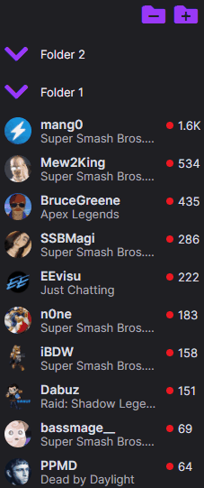

# Twitch Folders

Twitch folders is a Chrome extension that enables you to sort your Twitch channels into folders.

### Installation

[Node.js](https://nodejs.org/en/) is required for installation. Clone or download this repo, and run these commands within a terminal in the twitchfolders/ directory:

```
>npm install
>npm install -g gulp-cli
>gulp
```

This should create a dist/ directory with a manifest.json file inside.

Open Chrome and go to [chrome://extensions](chrome://extensions). Enable the developer mode toggle in the top right, then click "Load unpacked" and select the dist/ directory that was just created.

### Use



Currently folders can be created, named, and channels can be dragged between them. This configuration is saved and should stay persistent throughout multiple visits to the Twitch. To completely undo all changes you've made, you can click the extension icon and clear all the saved data.

Still to do:

- Reorder folders
- Rename folders
- Selectable delete
- Twitch API implementation
